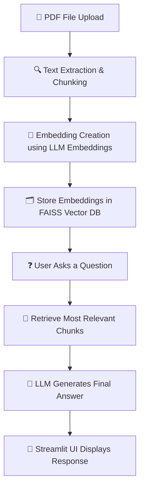

# 🤖 RAG-Powered PDF Chatbot

## 📖 Project Description
The **RAG-Powered PDF Chatbot** is an AI application that allows users to **upload a PDF file** and then **ask natural language questions** about its content.  
Using **Retrieval-Augmented Generation (RAG)**, the chatbot retrieves the most relevant information from the document and generates accurate, context-aware answers.  

This project is designed to help users quickly extract insights from long documents such as research papers, reports, and manuals — eliminating the need to read them line by line.

---

## 💡 Key Features
- 📂 **Upload any PDF file** (reports, research papers, or e-books)
- 🧠 **Retrieval-Augmented Generation (RAG)** for context-based question answering
- ⚡ **FAISS Vector Database** for efficient semantic search
- 🔗 **LangChain Integration** for document chunking, embeddings, and retrieval
- 💬 **Interactive Streamlit Interface** for smooth user interaction
- 🌐 **Pyngrok Deployment** for public access and live testing

---

## 🏗️ System Architecture

---

# 🤖 RAG-Powered PDF Chatbot

## 🛠️ Tools & Technologies

| Category | Tools / Libraries |
|-----------|------------------|
| 🧠 **LLM & Framework** | LangChain, OpenAI API |
| 🗂️ **Vector Database** | FAISS |
| 💬 **UI** | Streamlit |
| 🌐 **Deployment** | Pyngrok |
| 🐍 **Language** | Python |
| 📚 **Others** | PyPDF2, tiktoken, NumPy, Pandas |

---

## ⚙️ How It Works

1. 🧾 **Upload PDF** — The user uploads a document via the Streamlit interface.  
2. 🔍 **Extract & Chunk** — The PDF text is extracted and split into smaller, meaningful chunks.  
3. 🧩 **Embedding Creation** — Each chunk is converted into a numerical embedding using OpenAI embeddings.  
4. 🗂️ **Vector Storage** — The embeddings are stored in a FAISS vector database for efficient similarity search.  
5. 💬 **Question & Answer** — When a user asks a question, the system retrieves the most relevant chunks and passes them to the LLM to generate a context-aware, accurate answer.

---

## 🧪 Example Interaction

**User Uploads:** `Artificial_Intelligence_Research_Paper.pdf`  
**User Asks:**  
> "What are the main applications of AI mentioned in this paper?"

**Chatbot Responds:**  
> "The paper highlights key AI applications including autonomous vehicles, medical diagnostics, and predictive data analytics."

---

## 💡 Summary

This project demonstrates the power of **Retrieval-Augmented Generation (RAG)** by combining **LangChain**, **FAISS**, and **OpenAI LLMs** to build an intelligent PDF assistant.  
It allows users to **instantly query large documents** and get **accurate, summarized answers** without manual searching — all through an intuitive **Streamlit interface**.

---

## 🚀 Next Steps
- 🌍 Add **multilingual PDF support**
- 🤝 Integrate with **Chroma or Pinecone** for scalable vector storage
- 📱 Deploy a **web version** via Streamlit Cloud or Render
- ⚡ Improve response speed using **Distil models**
